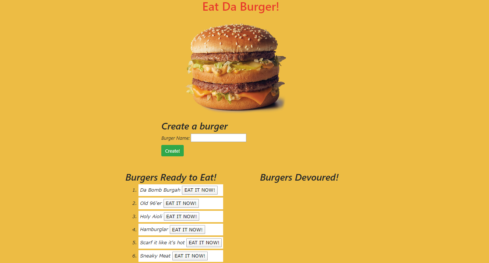

# UPenn-Week-13-Homework-EatDaBurger

# Purpose

Eat Da Burger is an entertainment app where users can create burgers of any kind.

# Usage

Users will run the app from their local server by running the command "node server.js" in their terminal. Navigating to the browser using URL "localhost:8080" will bring users to the single-page app. Users can type a name of a burger then click/tap the "Create!" button which will add their new burger to the "Burgers Ready to Eat" column. Clicking the "EAT IT NOW!" button will move the selected burger to the "Burgers Devoured!" column.

# GitHub repo
https://github.com/tdj03001/UPenn-Week-13-Homework-EatDaBurger

# Notes
App will eventually be deployed on the heroku platform with a URL so users don't have to start the localhost. This document will be updated once that is set up.